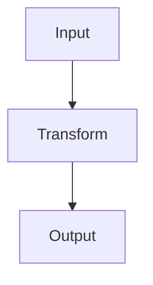

# Accessibility Status

Last updated: 2026-04-12

## Current Status

Accessibility is in a strong baseline state.

- Automated axe checks currently report no violations across audited routes.
- Coverage includes desktop and mobile viewports.
- Coverage includes light and dark themes.
- Coverage includes home, series routes, and all live blog post routes.

Public accessibility statement:
- `/accessibility-statement`

## Standards Target

The site targets WCAG 2.2 AA compliance and modern semantic HTML/ARIA best practices.

## Implemented Accessibility Features

- Theme-aware contrast refinements in light and dark modes.
- Keyboard focus visibility for key interactive controls.
- Keyboard access for horizontally scrollable table wrappers.
- Explicit accessible names for icon-only utility buttons.
- Single page-level H1 structure on blog pages.
- Mermaid accessibility support:
  - diagram-type fallback labels
  - caption-based naming (`aria-labelledby`)
  - optional long descriptions (`aria-describedby`)

## Testing Approach

- Playwright + axe route-level scans.
- Markdown pipeline tests for semantic output.
- Component tests for runtime accessibility wiring (for example Mermaid renderer behavior).
- Manual spot checks for keyboard navigation and theme readability.

## Accessible Markdown Authoring Guide

### Headings

- The post title is the page H1.
- Start post-body headings at H2 (`##`) and keep hierarchy logical.

### Links

- Use descriptive link text.
- Avoid generic labels like "click here".

### Tables

- Use proper markdown headers.
- Add brief surrounding context for complex tables.

### Code blocks

- Use fenced code blocks with language identifiers where possible.

### Mermaid diagrams

For complex diagrams, include both caption and description:

```md
<p class="mermaid-caption">High-level import pipeline</p>



<p class="mermaid-description">This flowchart shows data moving from input through transformation to output.</p>
```

Behavior:

- Caption is used for accessible name (`aria-labelledby`).
- Description is used for supplemental context (`aria-describedby`).
- Without caption, a diagram-type fallback label is used.

### Images and raw HTML

- Always provide meaningful alt text for images.
- Use raw HTML only when necessary.

### Pre-publish checklist

- Headings are sequential and descriptive.
- Links are meaningful out of context.
- Complex diagrams/tables have surrounding context.
- Accessibility tests are run before publishing.

## Known Limitations

- Automated scans do not replace full real-world assistive technology testing.
- Very complex diagrams may still benefit from richer narrative descriptions.

## Next Steps

- Add accessibility checks as a required CI gate.
- Keep authoring guidance enforced in publishing workflow.
- Periodically re-audit key routes as content and UI evolve.

## Key References

- `e2e/a11y-seo.spec.ts`
- `src/utils/markdown/markdownToHTML.ts`
- `src/utils/markdown/rehypeMermaid.ts`
- `src/utils/markdown/rehypeWrapTables.ts`
- `src/components/shared/MermaidRenderer.tsx`
- `src/app/accessibility-statement/page.tsx`
