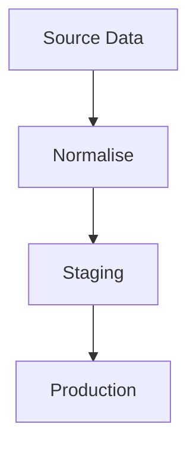

# JoeBloggsV3

Welcome to my personal blog! This is where I share my thoughts, projects, and frustrations.  
The site is built with modern technologies like **Next.js**, **React**, **TypeScript**, and **SCSS**.


## Features

- **Markdown-based blog posts:** Posts are written in `.md` files organized by folder, with related images stored locally.
- **Frontmatter metadata:** Each post includes structured frontmatter (`title`, `summary`, `date`, `dateModified`) automatically parsed.
- **Static Site Generation (SSG):** Each blog post and the homepage is pre-rendered at build time for performance and SEO.
- **Automatic SEO metadata:** Dynamic `<title>`, `<meta>` descriptions, Open Graph, and Twitter Card metadata per post.
- **Canonical URLs:** Each blog post includes a canonical URL for better SEO and duplicate content prevention.
- **Reading time and word count:** Estimated reading time and word count are automatically calculated and displayed for every post.
- **Responsive design:** Clean, mobile-first layouts built with semantic HTML and SCSS.
- **Dark mode and light mode:** Theme button to switch to and from dark mode, including code block and UI colors.
- **Markdown enhancements:** Support for GitHub-flavoured markdown (tables, strikethroughs, task lists, etc.) via `remark-gfm`.
- **Mermaid diagrams in posts:** Fenced `mermaid` blocks render as diagrams in blog post content with responsive, article-scoped styling.
- **Transformation visual blocks:** Fenced `transform` blocks render as a custom editorial visual for row/shape transformations without affecting normal code blocks.
- **Automatic Generation of public files:** Dynamic `robots.txt`, `sitemap.xml`, `rss.xml` and `recent-posts.json` files generated on build.
- **Reading Progress Indicator:** Custom progress bar as users scroll through a post.
- **Social Media Sharing:** Buttons to share posts on a variety of social media websites.


## Tech Stack

This project uses:

- [Next.js](https://nextjs.org/)
- [React](https://react.dev/)
- [TypeScript](https://www.typescriptlang.org/)
- [SCSS](https://sass-lang.com/)
- [unified](https://unifiedjs.com/) + [remark](https://github.com/remarkjs/remark) + [rehype](https://github.com/rehypejs/rehype) for Markdown-to-HTML processing
- [remark-gfm](https://github.com/remarkjs/remark-gfm) for GitHub flavoured markdown
- [rehype-highlight](https://github.com/rehypejs/rehype-highlight) for syntax highlighted code blocks
- [Mermaid](https://mermaid.js.org/) for rendered diagrams inside blog posts
- [FontAwesome](https://fontawesome.com/) (with selective icon imports)

## Markdown Authoring Notes

Blog posts support standard markdown plus custom fenced blocks in article content.

### Mermaid diagrams

Use a mermaid fenced block to render flowcharts and other Mermaid diagrams:



### Transformation visuals

Use a transform fenced block for explanatory data-shape transitions:

```transform
Spreadsheet row:
Plot 27 | Eaton 309 | Main Roof 470

↓ expand into category rows

Relational rows:
(27, Eaton 309, Main Roof, 470)
```

This renders as a custom article-friendly visual block. Other fenced code block languages continue to render as normal syntax-highlighted code.

## Getting Started

### Prerequisites

- [Node.js](https://nodejs.org/) installed


### Installation

1. Clone the repository:

   ```bash
   git clone https://github.com/JoeCastle/JoeBloggsV3.git
   cd JoeBloggsV3
   ```

3. Install dependencies:
   ```
   npm install
   ```


### Running the Project

1. Start the development server:
   ```
   npm run dev
   ```

2. Open your browser and visit [http://localhost:3000](http://localhost:3000) to view the blog.


## Project Structure Overview

- **src:** Contains the source code for the React application.
  - **app**  Next.js app routes (App Router).
    - **page.tsx** Homepage.
    - **blog/[slug]/** Dynamic blog post pages
  - **components:** React components.
    - **shared:** Components shared across multiple components or pages.
  - **posts:** Folders for the blog posts which group the markdown files and images.
  - **scss:** SASS files for styling the components and pages.
  - **utils:** Utility functions for blog posts and other general functionallity.
- **public** Static folder containing favicon and other assets.


## Available Scripts

- `npm run dev` - Run the dev server
- `npm run build` - Create a production build
- `npm test`
- `npm run test:ui`
- `npm run pretty`
- `npm run update-project-date`
   - Updates the date in `.env.local` to the current date.


## TODO:

- [x] Create project based on existing portfolio project.
- [x] Convert project from CRA to Next.js.
- [x] Write README.md.
- [x] Add blog post functionallity.
- [x] Add list of posts.
- [x] Add SEO metadata per page.
- [x] Update styling and structure of the list and post pages.
- [x] Write blog posts.
- [x] Add tests.


## License

The code in this project is licensed under the terms of the [LICENSE-website](LICENSE-website), while the content, including text and media, is licensed under the [LICENSE-content](LICENSE-content). See the respective files for detailed licensing information.
