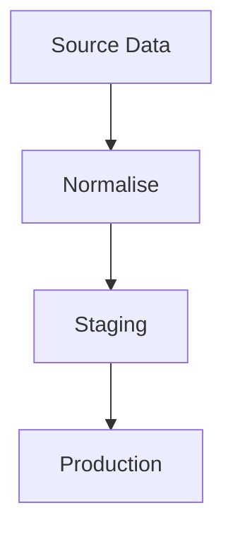
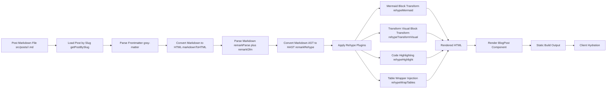
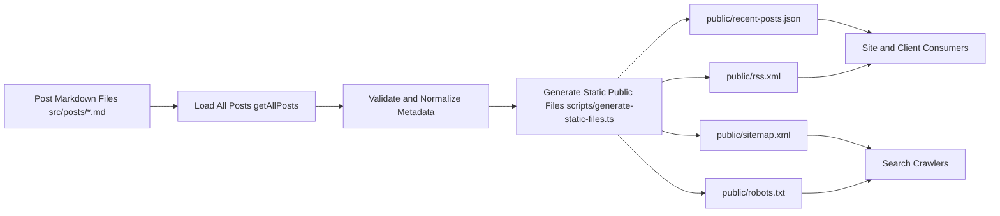

# JoeBloggsV3

A personal blog focused on high-quality technical writing, performance, and maintainable frontend architecture.

Built with Next.js App Router, TypeScript, and a custom markdown processing pipeline.

## Project Links

- Live site: [JoeBloggs](https://blog.joecastle.co.uk/)
- Repository: [GitHub](https://github.com/JoeCastle/JoeBloggsV3)

## At a Glance

- Markdown-driven publishing with custom mermaid and transform blocks
- SEO-ready pages with canonical links and JSON-LD structured data
- Static generation for fast content delivery
- Layered test suite (Vitest, Playwright, Lighthouse CI)
- Accessible, responsive UI with light/dark theme support

## Key Features

- Markdown-first publishing with per-post folders and local assets
- Frontmatter parsing and validation for structured post metadata
- Static generation for homepage and blog post routes
- Dynamic per-page SEO metadata (title, description, Open Graph, Twitter cards)
- Canonical URLs and BlogPosting JSON-LD structured data
- Automatic reading-time and word-count extraction
- Responsive layouts with light/dark theme support
- Markdown enhancements with GitHub Flavored Markdown support
- Mermaid diagram rendering from fenced mermaid blocks
- Custom transform visual blocks from fenced transform blocks
- Build-time generation of robots.txt, sitemap.xml, rss.xml, and recent-posts.json
- Reading progress indicator for long-form posts
- Social sharing actions for post pages

## Engineering Highlights

- Custom content pipeline using unified/remark/rehype with project-specific plugins
- Defensive post loading and frontmatter validation to handle malformed content safely
- E2E reliability helpers to reduce flake in accessibility, SEO, and visual tests
- Automated generation of sitemap, robots, RSS, and recent-post metadata artifacts
- Clear separation of route logic, rendering components, and utility modules

## Tech Stack

- Next.js (App Router)
- React
- TypeScript
- SCSS (Sass)
- unified + remark + rehype pipeline
- remark-gfm
- rehype-highlight
- Mermaid
- FontAwesome
- Vitest + Testing Library
- Playwright + @axe-core/playwright
- Lighthouse CI

## Markdown Authoring

Posts support standard markdown plus custom fenced blocks.

### Mermaid



### Transform Visuals

```transform
Spreadsheet row:
Plot 27 | Eaton 309 | Main Roof 470

-> expand into category rows

Relational rows:
(27, Eaton 309, Main Roof, 470)
```

## Architecture: Markdown to Render



Runs primarily at build-time for static generation, with final hydration behavior on the client.

## Architecture: Content Indexing and Static Files



Runs at build-time via the static file generation script to produce public metadata artifacts.

## Getting Started

### Prerequisites

- Node.js installed

### Installation

1. Clone the repository

```bash
git clone https://github.com/JoeCastle/JoeBloggsV3.git
cd JoeBloggsV3
```

2. Install dependencies

```bash
npm install
```

3. Run the development server

```bash
npm run dev
```

4. Open http://localhost:3000

## Scripts

- npm run dev: Start development server
- npm run build: Build production app (includes static file generation)
- npm run generate-static-files: Generate robots/sitemap/rss/recent-posts artifacts
- npm run start: Start production server
- npm run lint: Run linting
- npm test: Run Vitest suite
- npm run test:ui: Run Vitest UI mode
- npm run test:e2e: Run Playwright e2e suite
- npm run test:e2e:ui: Run Playwright UI mode
- npm run test:e2e:update-snapshots: Update visual snapshots
- npm run test:perf: Run Lighthouse CI checks

## Project Structure

- src/app: Next.js routes and layout
- src/components: Reusable UI components
- src/posts: Markdown content and per-post assets
- src/scss: Styling layers and component/page styles
- src/utils: Content loading, markdown processing, and shared utilities
- public: Static assets and generated public metadata files
- e2e: Playwright suites, snapshots, and reliability helpers

## Testing and Quality

The project uses layered testing and browser quality checks:

- Vitest for unit, component, and integration tests
- Playwright for end-to-end, accessibility, SEO, and visual regression
- Lighthouse CI for performance and quality thresholds

For full testing standards and coverage details, see [TESTING.md](TESTING.md).

## Deployment

Deployment process and release checklist are documented in [DEPLOYMENT.md](DEPLOYMENT.md).

## Screenshots (Optional)

Screenshots are optional if the project is live, but they can still improve quick scanning and offline review.

Suggested captures:
- homepage hero
- blog post page
- markdown mermaid/transform example
- test report summary screenshot

## License

Code is licensed under [LICENSE-website](LICENSE-website).
Content and media are licensed under [LICENSE-content](LICENSE-content).
