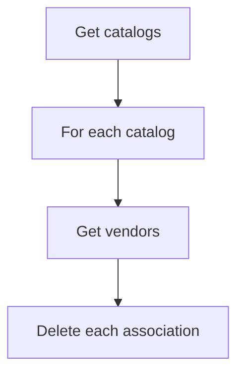
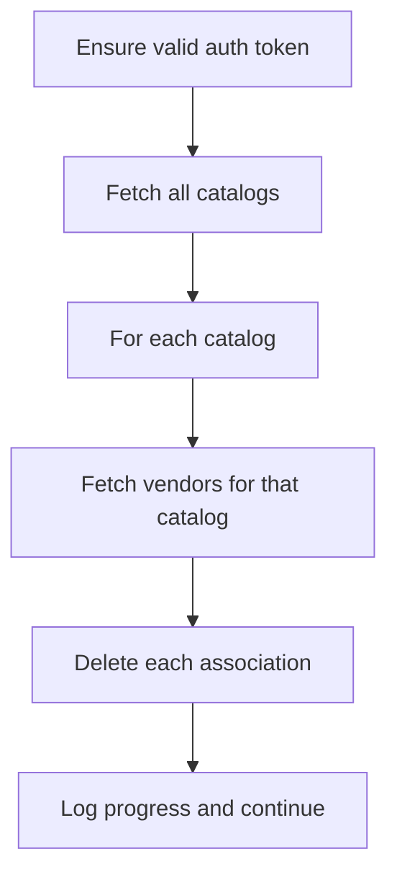
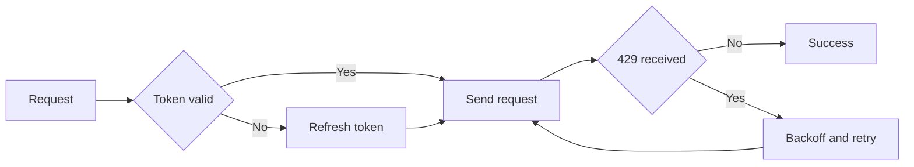

## Table of Contents

- [Introduction](#introduction)
- [The request](#the-request)
- [What made it difficult](#what-made-it-difficult)
- [The shape of the API determined the shape of the solution](#the-shape-of-the-api-determined-the-shape-of-the-solution)
- [Estimating the scale before writing too much code](#estimating-the-scale-before-writing-too-much-code)
- [The first mistake](#the-first-mistake)
- [Designing the deletion process](#designing-the-deletion-process)
- [Why I chose sequential processing](#why-i-chose-sequential-processing)
- [Rate limiting, retries, and not being a bad citizen](#rate-limiting-retries-and-not-being-a-bad-citizen)
- [The one-hour problem](#the-one-hour-problem)
- [Logging and simple resumability](#logging-and-simple-resumability)
- [Validation](#validation)
- [The real run](#the-real-run)
- [What I would change](#what-i-would-change)
- [Key lessons](#key-lessons)
- [Conclusion](#conclusion)
- [Where to Find Me](#where-to-find-me)

## Introduction

Every so often you get a task that sounds simple until you actually look at the constraints.

In this case, an existing customer needed to remove a large set of catalog-vendor associations from a third-party platform. Doing it manually through the UI was not realistic. There was too much data and no sensible way for someone to sit there deleting records one by one for days or weeks.

At first glance, this sounded like a straightforward integration utility. Read the records, call the delete endpoint, job done.

It was not that simple.

The API imposed strict rate limits, exposed only single-record deletion for the association I needed, did not provide a global listing endpoint, and used auth tokens that expired every hour. That combination turned a simple script into a long-running process that had to be safe to leave running for days.

> **Note**
> The customer details, IDs, names, and example values in this post have been anonymised and simplified. The structure of the problem and the engineering decisions are real.

## The request

A customer wanted a clean slate for a specific set of records stored in a third-party platform. I did not have access to their UI and was not involved in the business decision behind the reset. I was given API access, documentation, and a clear technical goal.

That goal was to remove catalog-vendor associations in a way that was safe, verifiable, and realistic at scale.

This was not just "delete some records". It was deleting a large volume of data through an API that was not designed for bulk cleanup. That distinction is what drives the implementation.

## What made it difficult

Four constraints defined the solution:

- No bulk delete endpoint  
- No global "get all associations" endpoint  
- Rate limiting at 10 requests per second across all request types  
- Auth tokens expiring roughly every hour  

Individually, these are normal. Together, they define the architecture.

## The shape of the API determined the shape of the solution

The absence of a global association endpoint was the most important surprise.

If the API had supported something like "get all catalog-vendor associations", the problem would have been much simpler. I could have enumerated the records directly and deleted them in a controlled loop.

But that endpoint did not exist.

That meant the process had to follow the structure of the API rather than the structure of the task:

1. Fetch all catalogs
2. For each catalog, fetch its vendors
3. For each vendor association in that catalog, call the delete endpoint individually

That nested traversal pattern is what drove the runtime.

<p class="mermaid-caption">API-driven traversal</p>



This is the point where the problem stopped being a quick script and became a long-running process design exercise.

## Estimating the scale before writing too much code

Once I understood the traversal pattern, I wanted rough numbers before going much further. I did not have a direct endpoint that would tell me the exact final deletion count up front, so I sampled the available endpoints, looked at real response shapes, and built an estimate based on what the API exposed.

At that point my rough calculation looked like this:

- ~170 requests to retrieve all catalogs
- ~170,000 requests to retrieve vendors across those catalogs
- ~680,000 delete requests for the associations themselves
- ~850,171 total requests overall in the working estimate

With a conservative assumption of roughly 500ms per request once overhead, throttling, and API latency were factored in, the estimate came out at about 118 hours. That is just under 5 days.

That was one of the few times in software where the estimate actually felt defensible. The shape of the work was constrained enough that the maths was not hand-wavy. Once the API contract fixed the traversal pattern, the runtime was mostly a multiplication problem.

| Step | Approximate Requests | Why |
|------|----------------------|-----|
| Fetch catalogs | 170 | Retrieve all catalog pages |
| Fetch vendors | 170,000 | Retrieve vendors across all catalogs |
| Delete associations | 680,000 | Delete each catalog-vendor association individually |
| **Total** | **850,171** | Combined estimate |

```text
850,171 requests * 500ms per request
= 425,085,500ms
= 425,085.5 seconds
= 118.08 hours
= just under 5 days
```

The exact final numbers were estimated rather than known in advance, but the estimate turned out to be close enough to be useful.

## The first mistake

My first mistake was underestimating the scale early on.

I ran an initial pass, saw the first set of results, and thought I was basically done. Then I realised I had not fully accounted for pagination and the actual volume of data behind it.

That was a useful correction.

It is one thing to know intellectually that an API is paginated. It is another thing to understand what that means once the page count is large enough that the traversal itself dominates the job.

That mistake improved the design, because after that point I stopped treating it as a simple delete utility and started treating it as a long-running batch process.

## Designing the deletion process

I built the tool as a C# console application in its own project within the existing solution for that customer. That was the most practical option at the time. It let me move quickly, reuse the existing context where useful, and keep the work easy to run without turning it into a bigger piece of infrastructure than it needed to be.

At a high level, the process was simple:

<p class="mermaid-caption">Deletion process overview</p>



The logic was straightforward. The engineering work was in making that process survivable over multiple days.

## Why I chose sequential processing

I chose to run the job sequentially rather than trying to parallelise it.

That was deliberate.

This was not a latency-sensitive production service. It did not need to complete as quickly as physically possible. It needed to complete as quickly as was reasonable without tripping rate limits, getting stuck overnight, or creating a more complicated recovery problem than necessary.

Parallelism would have increased complexity immediately:

- more coordination around rate limiting
- more difficult retry behaviour
- harder progress tracking
- harder recovery after interruption
- more moving parts for a one-off operational tool

Given the hard cap of 10 requests per second and the fact that I wanted to leave the process running unattended, sequential execution with controlled pacing was the right trade-off.

A simpler system that finishes reliably is better than a more clever one that is harder to trust.

## Rate limiting, retries, and not being a bad citizen

The API documentation was explicit: exceed 10 requests per second and you start getting HTTP 429 responses until traffic drops back under the threshold.

That shaped both the request pacing and the failure handling.

I added a small intentional delay between successful requests to keep the process comfortably under the limit, rather than trying to run right up against the threshold. That decision was partly practical and partly operational. I did not want the job to get itself throttled overnight, and I did not want to hammer someone else’s platform just because I technically could.

I also added retry logic with backoff for rate-limit responses and transient failures, so that the job would not fail instantly the first time something temporary went wrong.

A simplified version of the request wrapper looked like this:

```csharp
private static async Task<HttpResponseMessage> SendWithRateLimitAsync(
    Func<Task<HttpResponseMessage>> requestFunc)
{
    const int maxRetries = 5;
    int retryCount = 0;
    int baseDelayMs = 200;
    int backoffDelayMs = 1000;

    while (true)
    {
        var response = await requestFunc();

        if (response.IsSuccessStatusCode)
        {
            await Task.Delay(baseDelayMs);
            return response;
        }

        if ((int)response.StatusCode == 429)
        {
            retryCount++;
            if (retryCount > maxRetries)
            {
                return response;
            }

            await Task.Delay(backoffDelayMs);
            backoffDelayMs *= 2;
            continue;
        }

        return response;
    }
}
```

This is not sophisticated infrastructure code. It is intentionally simple. But it is enough to make a multi-day process much less fragile.

A request lifecycle like this is a good mental model for how the wrapper behaved:

<p class="mermaid-caption">Request lifecycle with token checks and retry handling</p>



## The one-hour problem

One of the more annoying problems only appeared once the real run got past the one-hour mark.

The auth tokens expired after roughly 3600 seconds. That is obvious in the documentation when you read it carefully, but short tests do not force you to confront what it means operationally.

My first substantial UAT run was around 45 minutes, which meant it never fully exercised the token-expiry boundary. Once the real run crossed that threshold, I had to add logic to refresh the token so the process could continue unattended.

That changed the tool from "can make authenticated requests" to "can keep itself authenticated over a multi-day execution window".

A simplified version of that guard looked like this:

```csharp
private async Task EnsureValidTokenAsync()
{
    if (DateTime.UtcNow < tokenExpiration)
        return;

    if (!string.IsNullOrEmpty(refreshToken))
        await RefreshAccessTokenAsync();
    else
        await GetNewAccessTokenAsync();
}
```

I also applied a small buffer before expiry so the token was refreshed slightly before the actual cutoff rather than right at the edge.

That is a good example of the difference between a short successful test and a genuinely reliable long-running process. A job that works for 45 minutes is not the same thing as a job that works for 5 days.

## Logging and simple resumability

I kept the logging simple, but useful.

The process logged:
- which catalog it was processing
- how many vendor associations were found
- each delete attempt
- counters for total processed, deleted, and failed
- elapsed time

A representative log fragment looked like this:

```text
Processing Catalog ID = 1001
  Found 4 vendors in Catalog 1001.
  [3850] Deleted Catalog Vendor 2001 from Catalog 1001
  [3851] Deleted Catalog Vendor 2002 from Catalog 1001
  [3852] Deleted Catalog Vendor 2003 from Catalog 1001
  [3853] Deleted Catalog Vendor 2004 from Catalog 1001
Processing Catalog ID = 1002
  Found 4 vendors in Catalog 1002.
  [3854] Deleted Catalog Vendor 2001 from Catalog 1002
  [3855] Deleted Catalog Vendor 2002 from Catalog 1002
  [3856] Deleted Catalog Vendor 2003 from Catalog 1002
  [3857] Deleted Catalog Vendor 2004 from Catalog 1002
```

That served two purposes.

First, it made debugging easier while I was building and testing the process.

Second, it made the process operationally usable. With a run this long, logs are not just for developers. They are how you know whether the job is healthy, where it is up to, and what happened if something interrupts it.

I also added a simple resume mechanism. It was not persisted checkpointing or anything elaborate. I could manually restart from a known page or point in the traversal because the process structure and logs made that possible.

That was enough for the job. I was not trying to build a generic job runner. I was trying to make a one-off operational tool resilient enough to survive real interruptions.

## Validation

I did not want to wait 5 days and then discover I had deleted the wrong thing.

Validation happened in layers.

I ran a small UAT test first so the customer could confirm the correct data was being affected.

Then I ran a longer UAT test, around 45 minutes, to exercise more of the traversal and confirm the process held up beyond a tiny happy-path run.

I also checked the API directly throughout development, including Postman checks, and matched logs back to real IDs and names where appropriate.

Finally, the customer confirmed the outcome through their own UI. I did not have direct access to it, but they could verify that the targeted data had actually been removed.

I also had log output showing catalogs returning zero associated vendors after processing, for example:

```text
Processing Catalog ID = 1101
  Found 0 vendors in Catalog 1101.
Processing Catalog ID = 1102
  Found 0 vendors in Catalog 1102.
Processing Catalog ID = 1103
  Found 0 vendors in Catalog 1103.
```

That combination was enough to make the final run defensible:
- test in UAT
- validate through API
- confirm through UI
- cross-check through logs

## The real run

Once the tool had been tested and hardened enough, I ran the full process against the live target set.

It ran for just over 5 days.

That was satisfying for two reasons. First, the customer got the clean-up they needed without having to spend months deleting records manually. Second, the runtime landed very close to the original estimate, which is rare enough in software to be worth appreciating.

The one genuinely annoying interruption was a power cut overnight. I checked everything before going to bed, woke up, and found the process had stopped because the machine had lost power. Fortunately, I had kept the resume approach simple enough that I could restart from a known point without rebuilding anything major.

That incident reinforced the right lesson. Long-running jobs do not just need correct logic. They need to survive boring real-world problems.

## What I would change

If I were doing this again, I would improve two things.

First, I would make resumability cleaner by persisting progress automatically rather than relying on a manual restart point. The manual approach was fine for this job, but a persisted checkpoint would make recovery simpler and reduce operator involvement.

Second, I would separate the HTTP and process orchestration pieces a bit more cleanly. For a one-off internal utility, the implementation was good enough. For something I expected to reuse repeatedly, I would tighten the structure and make observability more formal.

I would not change the main trade-off, though. I would still choose reliability and predictability over aggressive parallelism for a job like this.

## Key lessons

The most useful lessons from this piece of work were not specific to one vendor API.

### API shape matters more than you think
The absence of a global listing endpoint and a bulk delete endpoint was not a minor inconvenience. It defined the entire runtime and traversal strategy.

### Short tests do not prove long-run reliability
A process that works for 10 minutes or 45 minutes can still fail once token expiry, overnight execution, or intermittent errors enter the picture.

### Simplicity is often the right choice
Sequential processing, deliberate throttling, and simple resumability were all conscious decisions. More complexity would not have made this job better.

### Estimation is part of engineering
Once the request pattern was understood, the runtime could be approximated with reasonable confidence. That helped set expectations and design the process realistically.

### Logging is not just for debugging
For a multi-day job, logs become part of operations. They tell you whether the job is healthy, where it is up to, and how to recover if something breaks.

## Conclusion

What started as "build a utility to delete some records" turned into a good reminder that external constraints shape internal systems.

The difficult parts were not the delete calls themselves. They were:
- designing around an API that only exposed a slow nested path to the target records
- staying well under rate limits for days at a time
- surviving expiring auth
- making the job safe to leave unattended
- validating that the right data was being removed before and after the real run

The tool itself was not especially glamorous. It was a C# console application with careful pacing, retries, token refresh, progress logging, and a simple resume strategy.

That was enough.

In the end, the value was not in cleverness. It was in understanding the constraints, estimating the real cost, and building just enough engineering to make a multi-day process reliable.

## Where to Find Me

You can also follow me on <a href="https://github.com/JoeCastle" target="_blank" rel="noopener noreferrer">GitHub</a> or on my <a href="https://joecastle.co.uk" target="_blank" rel="noopener">Portfolio</a> for updates.
