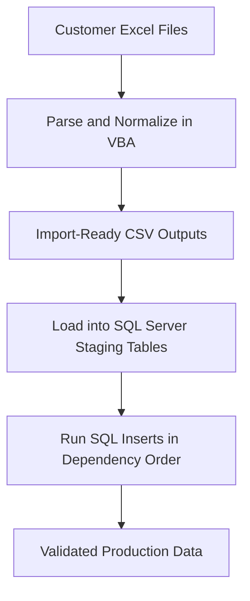

## Table of Contents

-   [Introduction](#introduction)
-   [The situation](#the-situation)
-   [High-level approach](#high-level-approach)
-   [What the data actually looked like](#what-the-data-actually-looked-like)
-   [The first wrong assumption](#the-first-wrong-assumption)
-   [Choosing the tool](#choosing-the-tool)
-   [Alternative approaches considered](#alternative-approaches-considered)
-   [The core transformation](#the-core-transformation)
-   [Identity was the critical part](#identity-was-the-critical-part)
-   [The most dangerous bug](#the-most-dangerous-bug)
-   [A debugging moment that changed the approach](#a-debugging-moment-that-changed-the-approach)
-   [Trade-off: flexibility vs strictness](#trade-off-flexibility-vs-strictness)
-   [Making it testable and safe](#making-it-testable-and-safe)
-   [The result](#the-result)
-   [What I would change](#what-i-would-change)
-   [Conclusion](#conclusion)
-   [Where to Find Me](#where-to-find-me)


## Introduction

A couple of months after joining a new project, I was asked to import a set of spreadsheets into our system.

At first glance it sounded straightforward. We had 30+ Excel files from a customer, and more were expected later, all of which needed to be imported into an existing production system backed by Azure SQL. In reality, this meant transforming tens of thousands of records across multiple relational tables, where a subtle mistake would not fail loudly, but silently corrupt production data.

This was not a simple spreadsheet import.

> **Note**
> The sample data and identifiers shown here have been anonymised and simplified. 
> The structure and challenges are real, but names and values have been changed.


## The situation

The system was already live. This was not a greenfield import.

The spreadsheets represented real customer data across multiple projects. If the import went wrong, the impact was not theoretical:

-   incorrect pricing
-   broken UI behaviour
-   inconsistent relationships between entities
-   difficult cleanup in production

I was the only developer on the project at the time, so this ended up being fully owned on my side. 

That included understanding an unfamiliar and unintuitive database schema on a project I had only recently joined, working with a non-technical PM to clarify what the data actually meant, building the transformation, designing the import process, testing against a production backup, and documenting everything so it could be repeated later. I had also never written VBA before.

I effectively acted as the technical owner for this work, making decisions across data modelling, transformation design, and production import strategy.

What made this interesting was that none of these challenges existed in isolation. I was learning an unfamiliar part of the system, working with inconsistent customer data, and trying to design a process that would still be usable months later when more files arrived.

I also documented the process heavily because I already knew more files were coming later, and I did not want the workflow to live only in my head.


## High-level approach

At a high level, the process looked like this:

- take raw Excel spreadsheets from the customer  
- run a VBA-based transformation to normalise and flatten the data  
- output import-ready CSV files  
- load those into staging tables in SQL Server  
- run controlled SQL scripts to insert into relational tables in the correct order  

This separation allowed me to validate the transformation before anything touched production.

The import order mattered because several tables depended on previously inserted records, so correctness was not just about values, but about preserving relational dependencies throughout the process.

<p class="mermaid-caption">High-level import pipeline</p>




## What the data actually looked like

The spreadsheets looked structured at a glance, but they were not structured data in the way a parser could safely rely on. They looked like tables, but they behaved more like reports, with important meaning implied by layout rather than explicit structure.

Section headers changed the meaning of columns. Merged cells shifted how headers were interpreted. Some values were visual summaries rather than real data.

That meant I could not treat the spreadsheets as reliable input. I had to treat them as something closer to semi-structured documents that needed interpretation before they could be transformed.

Across the files I was dealing with:

-   inconsistent headers
-   merged cells and section-based layouts
-   different sheet structures per project
-   missing values
-   totals rows mixed in with real data
-   columns that looked like data but were not
-   plot ranges like `142–150`
-   categories that appeared in some files but not others

Visually, they made sense. Programmatically, they were unreliable.

At the same time, the target was a relational model with multiple dependent tables.

So the real problem was not:

> read Excel and insert rows

It was:

> take semi-structured, presentation-oriented spreadsheets and transform them into consistent, relational data without breaking production integrity

In practice, not every problem was worth solving in code. Some spreadsheets still needed manual cleanup before they could be processed safely, and I documented that as part of the repeatable workflow rather than pretending the input was cleaner than it was.


## The first wrong assumption

My initial approach assumed the spreadsheets were consistent.

That broke quickly.

Some files had categories that others did not. Some headers were not where they appeared visually. Some columns changed meaning depending on section headers. Totals columns looked like real data if you did not explicitly exclude them.

The biggest shift was realising:

> this is not a mapping problem, it is a normalization problem

Once I realised this was a normalization problem, the approach became iterative.

I built a rough first pass, tested it against multiple spreadsheets, and then refined it as edge cases appeared. Each iteration exposed new assumptions that did not hold, which led to adjustments in how categories were detected, how ranges were expanded, and how output was structured.

Over time, the process became less about “getting a file out” and more about making the transformation predictable and safe.


## Choosing the tool

I considered building a small tool in C# or JavaScript, which are my usual languages, but I went with VBA instead. Not because it is ideal, but because it was the most pragmatic choice here: the source of truth was Excel, it ran directly where the data lived, it required no extra setup for other developers, and it was fast to iterate on.

This was not something that needed to run as part of the product. It needed to be run a handful of times, safely.

Given that, minimising friction mattered more than using a "cleaner" stack.

I also had to factor in who would run this in the future. This was not just a one-off script. It needed to be something that could be understood and reused by someone else, potentially months later.


## Alternative approaches considered

There were other viable approaches. A C# tool would have provided stronger typing, better testability, and cleaner separation of transformation logic. A Python script would have been a good fit for reshaping semi-structured spreadsheet data. A SQL-heavy staging approach or ETL tooling could also have handled parts of the pipeline.

In practice, each of these introduced additional setup, friction, or complexity relative to the task at hand.

Given that this needed to run a limited number of times, directly against Excel-based input, and be easy to hand over, VBA was the most pragmatic choice.

Technically, some of these approaches may have been cleaner. But in this case, reducing friction and enabling fast iteration mattered more than long-term elegance.


## The core transformation

The real challenge was not reading the spreadsheets. It was reshaping the data safely.

A typical row in the spreadsheet looked like this:

| Plot | Type | Main Roof | First Fix | Kitchen Units | Toilet Accessories | Plot Totals |
|------|------|-----------|-----------|---------------|--------------------|-------------|
| 27   | Eaton 309 | 470 | 1001 | 0 | 0 | 1471 |

At first glance, that looks like a single record. It is not.

What looks like one row is actually a compressed representation of multiple entities and multiple category values. The spreadsheet is column-oriented and designed for presentation, not for relational storage.

To make that explicit, this is what that single row becomes during transformation:

```transform
Spreadsheet row:
Plot 27 | Eaton 309 | Main Roof 470 | First Fix 1001 | Kitchen Units 0

↓ expand into category rows

Relational rows:
(27, Eaton 309, Main Roof, 470)
(27, Eaton 309, First Fix, 1001)
(27, Eaton 309, Kitchen Units, 0)
(27, Eaton 309, Toilet Accessories, 0)
```

This expansion step is the core of the transformation. Each category column becomes its own row, which can then be mapped cleanly into the relational model.

In the target system, that single spreadsheet row actually represented:

- one Plot  
- one CostingSheet  
- multiple CostingSheetLines  
- multiple CostingSheetItems  
- category references such as BuildStage  

The “Plot Totals” column is intentionally ignored during transformation, as it is a report artifact rather than a real data field.

Once expanded and mapped, the output becomes something like this:

| PlotId | PlotName | CostingSheetId | CostingSheetName | SalesCategory | BuildStageId | IsAdditional | Amount |
|--------|----------|----------------|------------------|---------------|--------------|--------------|--------|
| P-27 | 27 | CS-27-EATON309 | Eaton 309 | Main Roof | BS-MAINROOF | 0 | 470 |
| P-27 | 27 | CS-27-EATON309 | Eaton 309 | First Fix | BS-FIRSTFIX | 0 | 1001 |
| P-27 | 27 | CS-27-EATON309 | Eaton 309 | Kitchen Units | BS-KITCHENUNITS | 1 | 0 |
| P-27 | 27 | CS-27-EATON309 | Eaton 309 | Toilet Accessories | BS-TOILETACCESSORIES | 1 | 0 |

The important point is that the source sheet is column-oriented and presentation-driven, while the output must be row-oriented and relational.

That mismatch is the core transformation problem.


## Identity was the critical part

The most important design decision was how IDs were handled.

Not all IDs behave the same way.

I had to distinguish between:

- **existing, stable IDs**
  - categories and build stages already in production
- **project-level identities**
  - plots that should remain consistent within a project
- **row-level identities**
  - costing sheet lines that must be unique per record

If you get that wrong, you do not just get bad data. You get duplicated entities, broken foreign keys, and inconsistent relationships.

To handle this, I introduced a reference file that mapped known category names to existing IDs from the database.

Without this, the import would have created duplicate entities and broken relationships across the system, which would have been difficult to detect and even harder to correct once in production.

If a category existed, reuse its ID. If it did not, generate a new one.

That avoided duplicating live data and kept foreign keys consistent.


## The most dangerous bug

The worst issue I hit was silent corruption. In an early version, output columns were written based on position rather than explicit mapping. That meant a small shift could put values in the wrong columns without failing.

The file would still generate. Row counts would look reasonable. But the data would be wrong.

That is far worse than a hard failure.

The fix was to stop relying on position and always map by column name:

```vb
cPlotId = ColumnIndexOf(outWS, "PlotId")
cSalesCat = ColumnIndexOf(outWS, "SalesCategory")

outWS.Cells(outRow, cPlotId).Value = plotId
outWS.Cells(outRow, cSalesCat).Value = catName
```

That change made the output deterministic and significantly safer.


## A debugging moment that changed the approach

One of the most useful debugging moments came when the output looked plausible but was actually wrong.

I had a version of the transformation that produced files without crashing, but values were drifting into the wrong categories.

The breakthrough did not come from changing the transformation logic. It came from making the parser's assumptions visible.

I added a run log that captured:

-   which worksheet was used
-   which row was treated as the header
-   which columns were detected as Plot and Type
-   a snapshot of the detected header cells
-   how many category columns were matched
-   how many output rows were written

Once I had that, I could see that the parser was reading the spreadsheet differently from how it appeared visually.

Instead of asking "why is this value wrong?", I started asking:

> what exact structure did the parser think it was reading?

Once that was visible, the fix became straightforward.

With more than 30 files in play, the log was not just for debugging code. It became part of the operational process, making it obvious which file had failed, why it failed, and what needed to be fixed before rerunning the batch.


## Trade-off: flexibility vs strictness

One of the key design decisions was whether to make the import strict or forgiving.

A strict approach would only accept perfectly structured files. That would be easier to reason about, but it would fail often because the spreadsheets were inconsistent.

A forgiving approach was more practical, but also riskier.

The more flexible the parser became, the more careful I had to be about avoiding false positives.

I settled on a middle ground:

-   dynamic detection for real-world variability
-   explicit exclusion rules for non-data fields
-   reuse of existing IDs where required
-   logging to make decisions visible and auditable

That kept the process flexible without making it unsafe.


## Making it testable and safe

Before touching production, I ran the full process against a backup.

The steps were:

1.  take a copy of the production database
2.  run the full import process
3.  validate using SQL and the UI

I checked:

-   row counts against expectations
-   spot-checked values across multiple projects
-   verified relationships between entities
-   looked for broken UI behaviour

Only once that was clean did I run the import in production.

No rollbacks were required.

At that point, the goal was no longer just to make the process work. It was to be confident that it would not introduce subtle errors into a live system. A successful run was not one that completed without crashing, but one where the resulting data could be trusted.

I deliberately kept the import process project-by-project rather than fully batching everything at once, because it made validation and rollback reasoning much safer.


## The result

More spreadsheets arrived later, and the same process was reused with only minor adjustments.

-   30+ spreadsheets
-   30+ projects
-   ~75,000 transformed records
-   ~80,000-85,000 inserts across related tables

The final process had a few key characteristics:

-   ran in minutes
-   could be executed per project for safety
-   was repeatable for future data
-   significantly reduced the risk of human error

Based on rough estimates, doing this manually would likely have taken 400 to 600 hours of effort, roughly 2.5 to 4 months of work. The final process reduced that to a repeatable workflow that could be run in minutes per batch, with significantly lower risk of human error and much better traceability.


## What I would change

If I were doing this again, I would move the transformation rules out of VBA earlier and into a more testable pipeline.

The macro worked, but the complexity was not Excel automation. It was the transformation logic.

A small, testable pipeline with repeatable fixtures for edge cases would make regression testing much easier as the rules evolve.


## Conclusion

The difficult parts were:

-   interpreting an unfamiliar schema
-   translating between report-style input and relational output
-   designing a safe identity strategy
-   handling inconsistent real-world data
-   preventing silent corruption
-   building something repeatable and supportable

The macro was just the implementation. The biggest takeaway for me was that spreadsheet imports stop being "just automation" the moment the source is inconsistent and the destination is a live relational system.

That is where most of the work actually is, and it is the difference between something that runs and something you can trust.


## Where to Find Me

You can also follow me on <a href="https://github.com/JoeCastle" target="_blank" rel="noopener noreferrer">GitHub</a> or on my <a href="https://joecastle.co.uk" target="_blank" rel="noopener">Portfolio</a> for updates.
