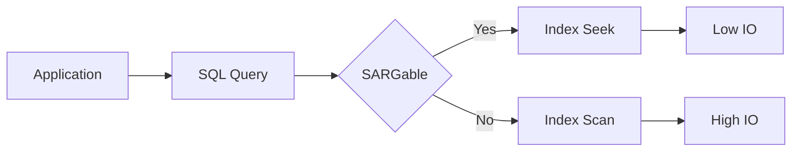
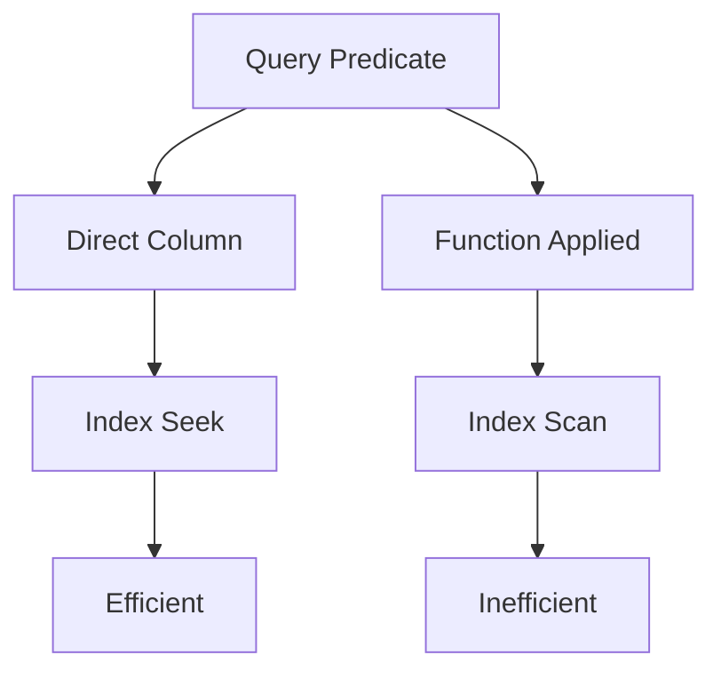
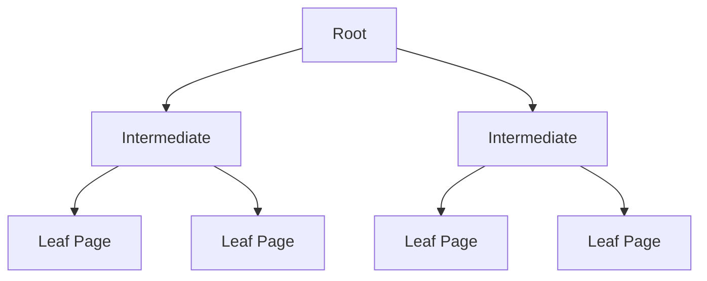
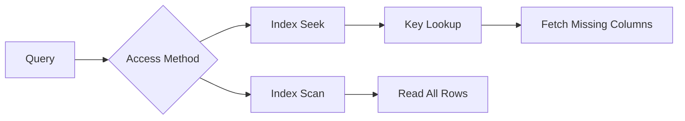
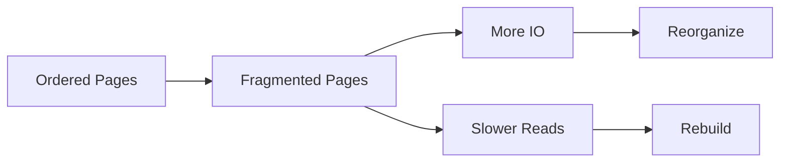
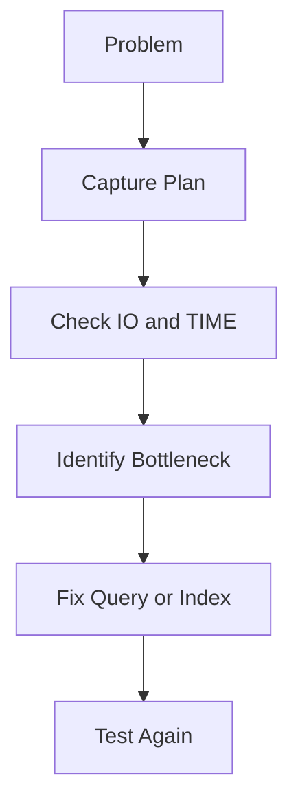

## Table of Contents

1. [Introduction](#1-introduction)
2. [Query Shape and SARGability](#2-query-shape-and-sargability)
3. [Index Design in Practice](#3-index-design-in-practice)
4. [Seeks, Scans, and Lookups Explained Properly](#4-seeks-scans-and-lookups-explained-properly)
5. [Measuring and Validating Performance](#5-measuring-and-validating-performance)
6. [Application-Level Performance Pitfalls](#6-application-level-performance-pitfalls)
7. [Misused “Optimisations” and Anti-Patterns](#7-misused-optimisations-and-anti-patterns)
8. [Index Maintenance and Fragmentation](#8-index-maintenance-and-fragmentation)
9. [A Practical Investigation Workflow](#9-a-practical-investigation-workflow)
10. [Final Summary](#10-final-summary)

## 1. Introduction

Most SQL Server performance issues are not caused by obscure edge cases or a slow database engine. They are caused by a small number of repeated problems.

<p class="mermaid-caption">SARGability impact on query performance</p>



  <p class="mermaid-description">The diagram shows that application queries flow into a SARGability decision. SARGable predicates lead to index seeks and lower IO, while non-SARGable predicates lead to scans and higher IO.</p>

- Queries that prevent index usage
- Poorly designed or excessive indexes
- Fetching more data than required
- Inefficient data access patterns in application code

This guide focuses on the patterns that consistently matter in production systems.

## 2. Query Shape and SARGability

### Example

```sql
-- Non-SARGable
SELECT *
FROM Orders
WHERE YEAR(OrderDate) = 2025;

-- SARGable
SELECT OrderId, CustomerId, OrderDate
FROM Orders
WHERE OrderDate >= '2025-01-01'
  AND OrderDate < '2026-01-01';
```

### Explanation

In the first query, SQL Server must evaluate `YEAR(OrderDate)` for every row. It cannot directly use an index because the column is wrapped in a function.

In the second query, SQL Server can:

1. Use the index to navigate directly to the first matching row
2. Read only the required range
3. Stop when the range ends

This is what makes a predicate **SARGable**.

<p class="mermaid-caption">Predicate shape drives access method</p>



  <p class="mermaid-description">This diagram contrasts direct column predicates with function-wrapped predicates. Direct predicates map to index seeks and better efficiency, while function-wrapped predicates tend toward scans and poorer efficiency.</p>

### Key Insight

SQL Server is extremely efficient when it can:

- Compare raw column values
- Navigate indexes using ranges or equality

It becomes inefficient when it must:

- Transform values first
- Evaluate expressions row-by-row

### Checklist

- Avoid functions on indexed columns
- Avoid leading wildcards (`LIKE '%value'`)
- Filter early to reduce row counts
- Avoid `SELECT *`

## 3. Index Design in Practice

Indexes are not free. They trade write performance and storage for read performance.

### Clustered vs Nonclustered

- Clustered index: defines how data is physically ordered
- Nonclustered index: separate structure referencing the data

SQL Server uses a **B-tree structure**:

<p class="mermaid-caption">Simplified B-tree index navigation</p>



  <p class="mermaid-description">The chart illustrates root, intermediate, and leaf pages in a B-tree. SQL Server navigates from root to relevant leaf pages instead of scanning all rows.</p>

At a practical level, this means SQL Server can navigate an index rather than reading every row. That is the reason seeks are usually fast: the engine walks the tree to the relevant part of the structure instead of scanning the whole thing.

### Composite Index Example

```sql
CREATE INDEX IX_Orders_Customer_Date
ON Orders (CustomerId, OrderDate);
```

Works well for:

```sql
WHERE CustomerId = 10
WHERE CustomerId = 10 AND OrderDate >= '2025-01-01'
```

Does NOT work efficiently for:

```sql
WHERE OrderDate >= '2025-01-01'
```

Because SQL Server cannot skip the first column in the index key.

### Covering Index Example

```sql
CREATE INDEX IX_Orders_Customer
ON Orders (CustomerId)
INCLUDE (OrderDate, TotalAmount);
```

Now SQL Server can:

- Find rows using the index
- Return results without accessing the base table

### Selectivity

- High selectivity: few rows per value → effective index
- Low selectivity: many rows per value → often less useful

### Filtered Index

```sql
CREATE INDEX IX_Orders_Active
ON Orders (CustomerId)
WHERE Status = 'Active';
```

Useful when queries repeatedly target a subset of rows.

### Trade-offs

Every index:

- Slows INSERT, UPDATE, DELETE
- Consumes memory and disk
- Needs maintenance

The goal is not to add every potentially useful index. The goal is to add the fewest indexes that meaningfully improve the read patterns that matter most.

### Checklist

- Index columns used in filters and joins
- Order columns based on query patterns
- Avoid redundant indexes
- Monitor usage over time

## 4. Seeks, Scans, and Lookups Explained Properly

### Index Seek

A seek is a **navigation operation**.

SQL Server:

1. Starts at the root of the B-tree
2. Follows pointers down the tree
3. Lands directly on the relevant leaf nodes

It uses known key values to jump to the correct location.

### Index Scan

A scan is a **sequential read**.

SQL Server:

1. Starts at the beginning of the index
2. Reads rows in order
3. Applies filtering as it goes

It does not have a selective predicate to locate specific rows, so it reads everything (or a large portion).

### When Scans Are the Right Choice

Scans are not inherently bad.

They are often the correct choice when:

- A large percentage of the table is needed
- The cost of seeks plus lookups exceeds scanning
- The data is already ordered in a useful way

The goal is not to eliminate scans. The goal is to reduce unnecessary ones.

### Key Lookup

A lookup is a **secondary fetch operation**.

SQL Server:

1. Uses a nonclustered index to find matching rows
2. The index does not contain all required columns
3. Retrieves the remaining columns from the clustered index

This means:

- The index gives the location
- The lookup retrieves the data

If this happens thousands of times, it becomes expensive.

### Why Key Lookups Become Expensive

A key lookup is cheap when it happens a few times.

It becomes expensive when:

- The outer query returns many rows
- Each row triggers another read
- The engine repeatedly hops back to the clustered index or heap

That pattern scales poorly. In practical terms, it behaves like an N+1 problem inside the database engine.

<p class="mermaid-caption">Access method and lookup cost path</p>



  <p class="mermaid-description">The diagram shows two execution paths: index scan reads many rows directly, while index seek may branch into key lookups to fetch missing columns, which can become expensive at scale.</p>

### Important Distinction

Execution plans show:

- Index Seek
- Index Scan
- Key Lookup

DMVs track:

- `user_seeks`
- `user_scans`
- `user_lookups`

These are aggregated counters, not per-query operations.

### Checklist

- Prefer seeks for selective queries
- Scans are acceptable for large result sets
- Watch for repeated lookups in large queries

## 5. Measuring and Validating Performance

### Enable Metrics

```sql
SET STATISTICS IO ON;
SET STATISTICS TIME ON;
```

### What to Look For

- Logical reads → how much data is accessed
- CPU time → processing cost
- Execution plan → how data is accessed

### Execution Plans

Always use **actual execution plans**.

They show:

- Actual rows vs estimated rows
- Real operators used


### Why Row Estimates Matter

SQL Server makes decisions based on estimated row counts.

If estimates are wrong:

- It may choose a scan instead of a seek
- It may choose a nested loop instead of a hash join
- It may underestimate the cost of key lookups

This is why:

- Outdated statistics
- Non-SARGable predicates
- Complex expressions

can all lead to poor execution plans.

Improving estimates often improves performance without changing the query structure.


### Query Store

Tracks:

- Query history
- Performance trends
- Regressions


### Parameter Sensitivity

SQL Server caches execution plans based on initial parameter values.

This can lead to:

- A plan optimised for a small dataset being reused for a large one
- Or vice versa

This is commonly known as parameter sniffing.

This is not a query problem, but a plan selection problem.

In these cases, the issue is not indexing or query shape, but plan reuse.


### Checklist

- Measure before changing anything
- Compare before vs after
- Focus on logical reads first

## 6. Application-Level Performance Pitfalls

### N+1 Queries

- 1 query for parent data
- N additional queries for child data

Results in excessive round trips.

### Chatty Access

- Multiple small queries instead of one efficient query

### Over-fetching

- Retrieving unnecessary columns or rows

### Connection Handling

- Open late, close early

### Checklist

- Avoid loops hitting the database
- Batch operations
- Use set-based queries

## 7. Misused “Optimisations” and Anti-Patterns

### NOLOCK

- Allows dirty reads
- Can return inconsistent results
- Does NOT eliminate all locking

### Missing Index Suggestions

- Context-specific
- May overlap
- Increase write cost

### Scalar Functions

- Can force row-by-row execution
- May prevent optimisations

### Checklist

- Avoid blind optimisations
- Validate everything with metrics

## 8. Index Maintenance and Fragmentation

Indexes fragment over time due to inserts and updates.

### Reorganize vs Rebuild

- Reorganize → lightweight
- Rebuild → full rebuild, more expensive

### Important Warning

Rebuilding indexes:

- Uses CPU and IO
- Can block or slow queries
- Should not be done during peak usage

<p class="mermaid-caption">Fragmentation and maintenance options</p>



  <p class="mermaid-description">This diagram shows that page fragmentation increases IO and can slow reads. Maintenance options branch to reorganize or rebuild depending on severity and operational constraints.</p>

### Checklist

- Monitor fragmentation
- Schedule maintenance carefully
- Avoid unnecessary rebuilds

## 9. A Practical Investigation Workflow

A simple workflow helps avoid guessing and makes it easier to isolate the biggest problems first.

<p class="mermaid-caption">Performance investigation workflow</p>



  <p class="mermaid-description">The workflow starts with reproducing a problem, then collecting plan and metrics, identifying bottlenecks, applying focused query or index changes, and retesting iteratively.</p>

1. Reproduce the issue
2. Capture the actual execution plan
3. Enable statistics
4. Identify expensive operations
5. Check indexes
6. Validate with real data
7. Apply changes incrementally

### What Actually Fixes Performance Most Often

In real systems, most improvements come from:

- Fixing non-SARGable predicates
- Reducing over-fetching
- Adding or adjusting one useful index
- Eliminating repeated lookups

Not from rewriting everything at once.

### What to Check First

- Logical reads
- Execution plan operators
- Row estimate accuracy
- Index usage

## 10. Final Summary

Focus on:

- Writing SARGable queries
- Designing indexes intentionally
- Understanding execution plans
- Measuring performance correctly
- Avoiding inefficient application patterns

## Where to Find Me

You can also follow me on [GitHub](https://github.com/JoeCastle) or on my [Portfolio](https://joecastle.co.uk) for updates.
